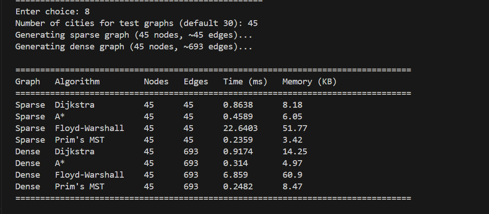
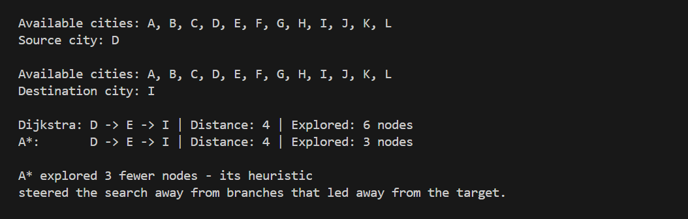
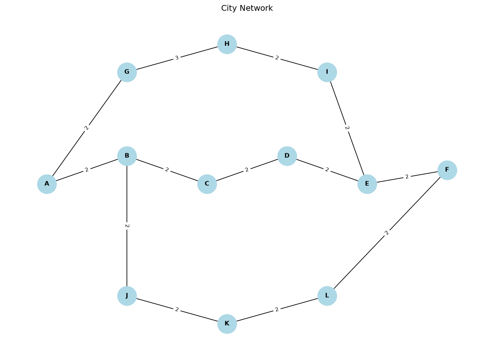
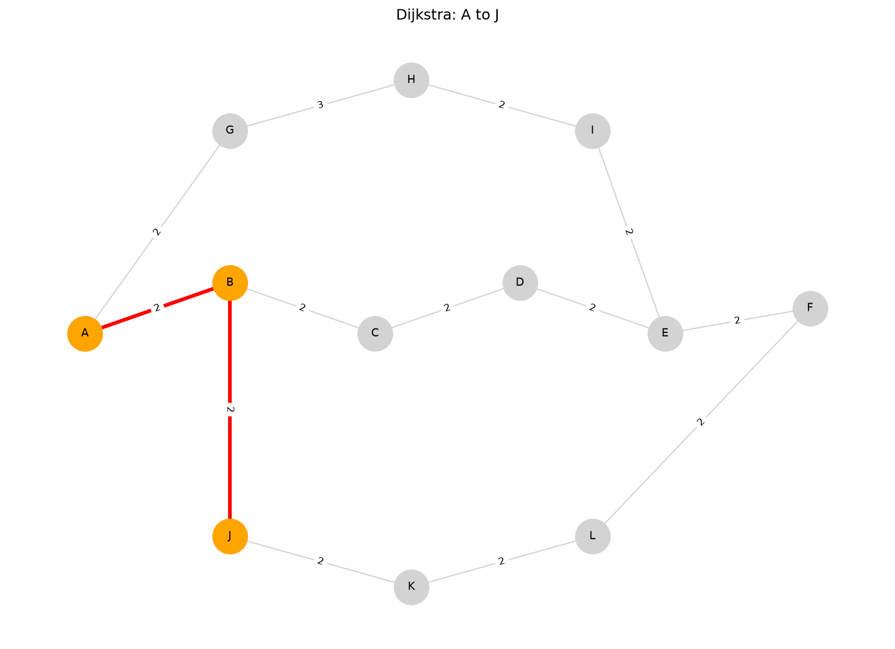
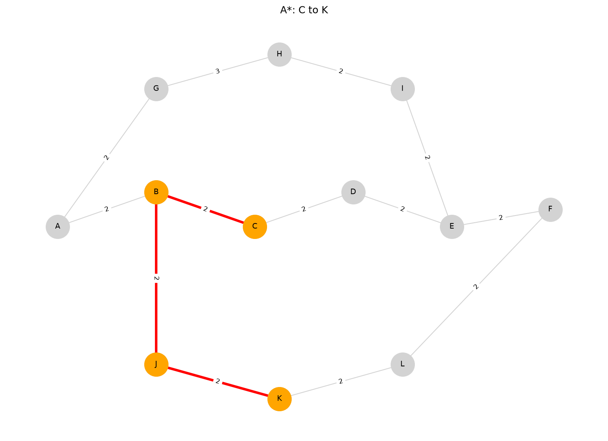
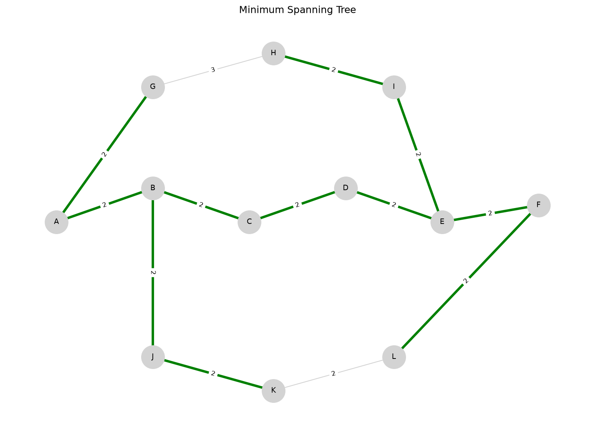

# Route Optimization System

A graph-based analysis and route optimization system developed for my Design and Analysis of Algorithms (DAA) course in Python.

This project demonstrates the implementation and visualization of classical graph algorithms used in route planning and network optimization.

## Features

- Graph creation and visualization
- Dijkstra's Shortest Path Algorithm
- A* Search Algorithm
- Prim's Minimum Spanning Tree (MST)
- Performance analysis and comparison
- Execution time benchmarking
- Memory usage comparison
- Automatic graph visualizations

## Performance Evaluation

The project compares the implemented algorithms based on:
- Execution Time
- Memory Usage
- Algorithm Efficiency
This provides insight into the trade-offs between different graph algorithms for route optimization and helps demonstrate their practical performance on the same graph.



We also compare Dijkstra and A* algorithm on the same level.



## Algorithms Implemented

### Dijkstra's Algorithm
Computes the shortest path between a source node and destination node in a weighted graph.

### A* Search Algorithm
Uses heuristic-based search to efficiently find optimal paths.

### Prim's Algorithm
Generates a Minimum Spanning Tree that connects all vertices with minimum total edge weight.

## Project Structure

```text
algorithms.py    # Graph algorithms
graph.py         # Graph construction and management
visualizer.py    # Graph visualization functions
analyzer.py      # Algorithm analysis utilities
main.py          # Program entry point
images/          # Generated visual outputs
```

## Technologies Used

- Python
- NetworkX
- Matplotlib

## Installation

Clone the repository:

```bash
git clone https://github.com/arfakamranbutt/route-optimization-system.git
cd route-optimization-system
```

Install dependencies:

```bash
pip install -r requirements.txt
```

Run the project:

```bash
python main.py
```

## Sample Outputs

### Original Graph



### Dijkstra Shortest Path



### A* Search Path



### Minimum Spanning Tree



## Learning Outcomes

This project demonstrates practical applications of:

- Graph Theory
- Shortest Path Algorithms
- Greedy Algorithms
- Algorithm Analysis
- Data Structures

## Future Improvements

- Interactive GUI using Streamlit
- Real-world map integration
- Traffic-aware routing
- Runtime benchmarking on larger datasets
- Additional graph algorithms

## Author

Arfa Kamran
CS Student
